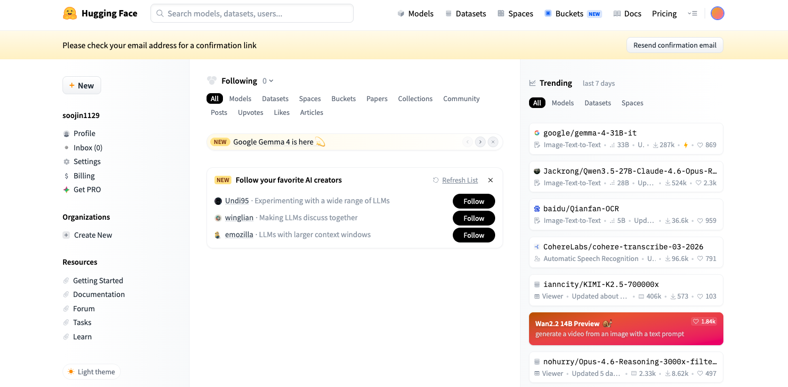
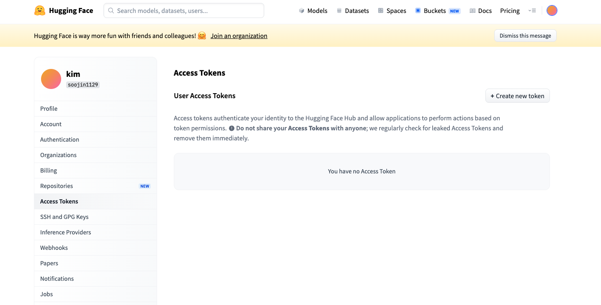
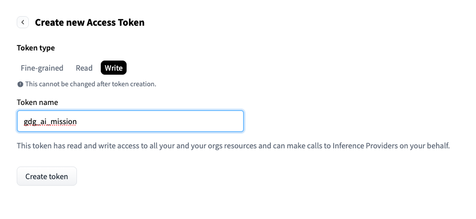
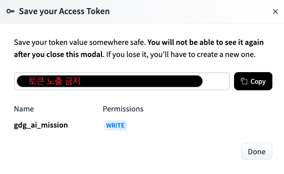
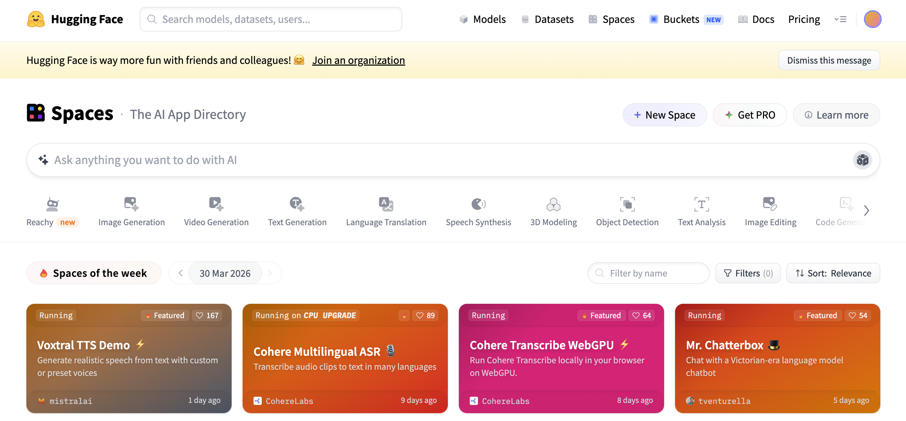
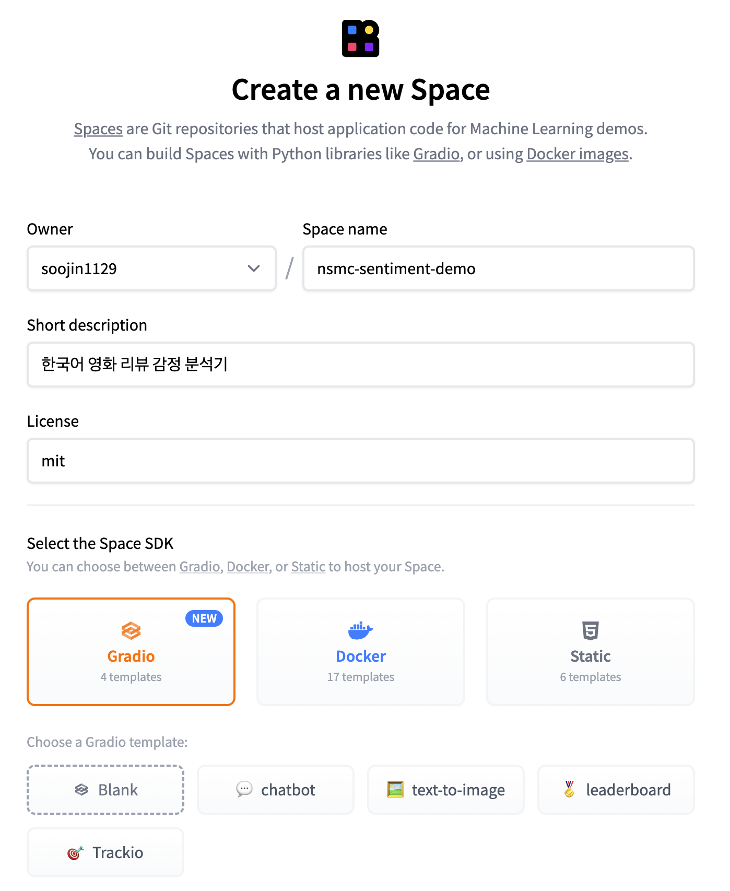
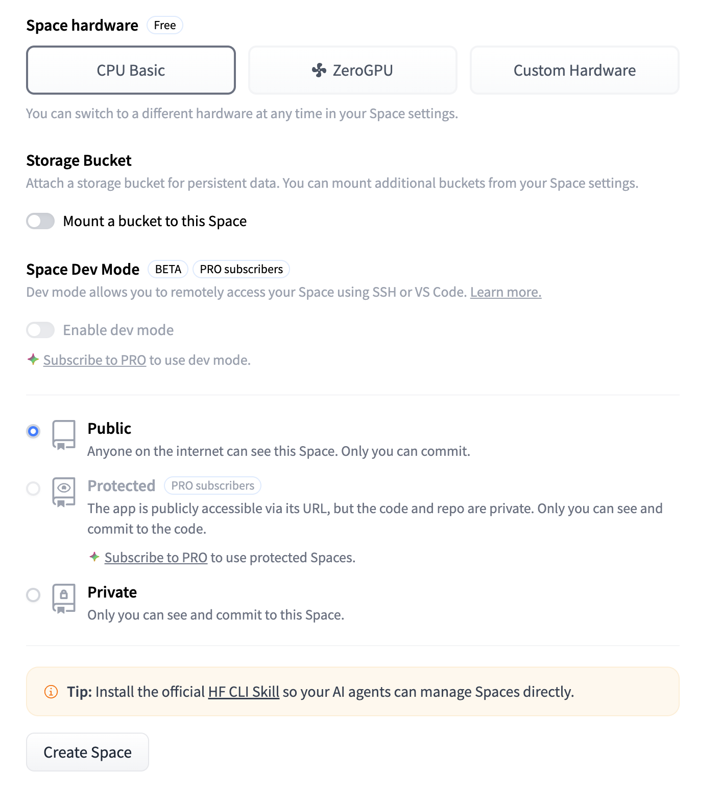
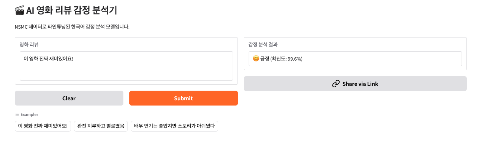

# week4

Week1~3에서 우리는 데이터 전처리, 모델 학습, 파인튜닝, RAG까지의 개념을 모두 배워보았습니다. 

그러나 지금까지 만든 모델은 Colab에서만 돌아갑니다. Colab 세션이 끊기면 사라지고, 나만 사용할 수 있죠. 아무리 뛰어난 AI 모델도 다른 사람이 사용할 수 없다면 의미가 없습니다.

Week4에서는 우리가 만든 모델을 **실제로 누구나 접속할 수 있는 웹 서비스로 출시하는 과정**, 즉 **배포(Deployment)** 를 배울 예정입니다.

---

### 이번 주차의 학습 목표

- fine-tuning 파이프라인 구성
- 배포(Deployment)의 개념과 중요성 이해
- HuggingFace Hub에 모델 업로드
- Gradio를 활용한 AI 웹 인터페이스 제작
- HuggingFace Spaces를 통한 공개 배포

## Mission1 (파인튜닝 모델 구성하기)

Week3에서는 이미 학습된 모델을 가져와서 우리 문제에 맞게 다시 학습시키는 Fine-Tuning의 개념을 배웠습니다. 

기존 BERT는 한국어 문장을 이해할 수 있는 사전학습 모델이지만, 처음부터 “영화 리뷰가 긍정인지 부정인지”를 판단하도록 만들어진 것은 아닙니다. 그래서 BERT가 이미 가지고 있는 언어 이해 능력은 그대로 활용하고, 마지막 분류 부분을 감정 분석 데이터에 맞게 다시 학습시키는 과정이 필요합니다.

이번 Week4에서는 이 Fine-Tuning 과정을 직접 하나의 파이프라인으로 구성해봅시다!

단순히 모델을 불러오는 것에서 끝나는 것이 아니라, 데이터 준비부터 tokenizing, 학습, 평가, 예측까지 Fine-Tuning 모델을 만드는 전체 흐름을 직접 구현해보는 것이 목표입니다.

밑의 조건에 맞게 Fine-Tuning 모델을 자유롭게 구성해보아요!

```markdown
# 1. NSMC 데이터 다운로드 및 데이터 구성
- NSMC train 데이터를 다운로드해주세요.
- 리뷰 문장(text)과 감정 라벨(label)을 각각 분리해주세요.
- text와 label 형태로 데이터를 구성해주세요.
- 모델 구성에 일부 데이터만 사용해도 괜찮습니다.

# 2. HuggingFace 사전학습 모델 불러오기
- transformers 라이브러리를 사용해주세요.
- 한국어 BERT 계열 모델을 사용해주세요.
- Tokenizer와 Sequence Classification 모델을 각각 불러와주세요.
- 감정 분석은 긍정/부정 분류이므로 label=2로 설정해주세요.

# 3. Dataset 구성하기
- HuggingFace datasets 라이브러리의 Dataset 객체를 사용해주세요.
- text와 label이 포함된 Dataset을 구성해주세요.
- train / validation 데이터를 분리해주세요.

# 4. Tokenizing 함수 구현하기
- tokenizer를 사용하여 문장을 tokenizing 해주세요.
- `truncation` 옵션을 설정하여 너무 긴 문장이 잘리도록 해주세요.
- `padding` 옵션을 설정하여 문장 길이를 일정하게 맞춰주세요.
- `max_length` 값을 직접 지정해주세요.

# 5. Fine-Tuning 학습 구성하기
- Fine-Tuning 학습을 위한 하이퍼파라미터를 설정해주세요.
- 학습(train) 데이터와 검증(validation) 데이터를 활용하여 모델을 학습해주세요.
- HuggingFace 기반 Fine-Tuning 방식으로 학습을 진행해주세요.

# 6. 모델 성능 평가하기
- validation dataset 기준으로 성능을 평가해주세요.
- Accuracy 또는 이에 준하는 metric을 출력해주세요.

# 7. 감정 분석 테스트하기
- Fine-Tuning이 완료된 모델을 사용하여 실제 문장을 예측해주세요.
- 최소 3개의 문장을 직접 테스트해주세요.
- 긍정/부정 결과를 출력해주세요.
```

## Mission2 (huggingface 배포)

이번 Week4의 두번째 목표는 앞서 만든 파인튜닝 모델을 실제 웹 서비스로 배포합니다.

**Gradio** 로 UI를 만들고, **HuggingFace Spaces**에 올리면, 링크 하나로 누구든 언제든 접속할 수 있는 서비스가 완성됩니다.

- [ ]  **배포(Deployment)** 가 무엇인지, AI 프로젝트에서 왜 필요한지 정리해주세요.
- [ ]  **Gradio** 가 무엇인지 정리해주세요.
- [ ]  **HuggingFace** 가 무엇인지 정리해주세요.

우선 배포를 하기 전, Hugging Face에 접속하여 회원가입 및 로그인을 해주세요.

https://huggingface.co/

<p align="left">
  
</p>


이후 왼쪽 사이드에 있는 Settings 메뉴로 들어갑니다. 

<p align="left">
  
</p>

왼쪽 사이드바에서 Access Tokens 항목을 클릭해주세요.

<p align="left">
  
</p>


New Token 버튼을 클릭하고 아래와 같이 설정합니다.

- Token name: 원하는 이름으로 자유롭게
- Role: Write ← 반드시 Write로 설정해야 합니다!
(Read 권한은 모델을 읽기만 할 수 있고, Write 권한이 있어야 모델을 업로드할 수 있습니다.)

<p align="left">
  
</p>


Generate Token 버튼을 클릭하면 토큰이 생성됩니다. 토큰은 다시 확인할 수 없으니 반드시 복사해주세요!

또한, 토큰이 유출되면 타인이 내 계정으로 모델을 업로드하거나 삭제할 수 있습니다. 만약 실수로 노출됐다면 즉시 Settings → Access Tokens 에서 해당 토큰을 삭제하고 새로 발급받으세요.

```python
# 다시 Colab으로 돌아와서 실행
from huggingface_hub import notebook_login
notebook_login()
```

실행하면 토큰 입력창이 뜹니다. 위 단계에서 복사한 토큰을 넣어주세요.

```python
MY_MODEL_NAME = "본인 HF 아이디/nsmc-sentiment" #본인 아이디로 설정

model.push_to_hub(MY_MODEL_NAME)
tokenizer.push_to_hub(MY_MODEL_NAME)

print("업로드 완료!")
print(f"모델 주소: https://huggingface.co/{MY_MODEL_NAME}")
```

`push_to_hub()`는 Week3에서 파인튜닝한 모델을 HuggingFace Hub에 업로드합니다.
GitHub에 코드를 올리는 것처럼, HuggingFace Hub는 **AI 모델을 올리는 저장소**입니다. 모델 파일과 토크나이저가 내 HF 계정에 저장되어 이후 어디서든 불러올 수 있게 됩니다.

<p align="left">
  
</p>

우리가 만든 모델을 웹 서비스로 배포하려면, 서버가 필요합니다. HuggingFace Spaces는 Gradio 앱을 무료로 24시간 호스팅해주는 플랫폼으로, 복잡한 서버 설정 없이 간단하게 배포할 수 있습니다. 

HuggingFace에 접속한 뒤, 우측 상단 + 버튼을 클릭하고 New Space를 선택합니다.

<p align="left">
  
  
</p>

Space 설정 화면에서 아래와 같이 설정해주세요.

- Space name: 원하는 이름을 입력합니다. (영문, 숫자, -, _ 만 사용 가능합니다.)
- Short description: 간단한 설명을 입력해주세요. (선택사항)
- License: mit 를 선택해주세요.
- SDK: Gradio - 우리가 만든 웹이 Gradio 기반이기 때문입니다.
- Template: Blank
- Visibility: Public - 다른 사람들도 접속가능!

→ 모든 설정이 완료되면 Create Space 버튼을 클릭합니다.

```python
from huggingface_hub import HfApi

MY_MODEL_NAME = "본인아이디/nsmc-sentiment" # 위에서 설정한 모델명으로 변경
MY_SPACE_NAME = "본인아이디/spacename" # 본인이 설정한 spacename으로 변경

# HuggingFace Hub에 업로드한 감정 분석 모델을 불러와 Gradio 웹앱으로 실행하는 코드입니다.
# Gradio UI 코드 부분은 자유롭게 구성하셔도 됩니다. 
app_code = f'''
import gradio as gr
from transformers import pipeline

classifier = pipeline("text-classification", model="{MY_MODEL_NAME}")

def format_result(result):
    label = result["label"]
    score = result["score"]

    if label == "LABEL_1":
        emoji, label_kr = "😊", "긍정"
    else:
        emoji, label_kr = "😞", "부정"

    return f"{{emoji}} {{label_kr}} (확신도: {{score:.1%}})"

def predict(text):
    if not text.strip():
        return "문장을 입력해주세요."
    result = classifier(text)[0]
    return format_result(result)

demo = gr.Interface(
    fn=predict,
    inputs=gr.Textbox(label="영화 리뷰", placeholder="리뷰를 입력하세요...", lines=3),
    outputs=gr.Textbox(label="감정 분석 결과"),
    title="AI 영화 리뷰 감정 분석기",
    description="NSMC 데이터로 파인튜닝된 한국어 감정 분석 모델입니다.",
    examples=[
        ["이 영화 진짜 재미있어요!"],
        ["완전 지루하고 별로였음"],
        ["배우 연기는 좋았지만 스토리가 아쉬웠다"]
    ]
)
demo.launch()
'''

with open('app.py', 'w', encoding='utf-8') as f:
    f.write(app_code)

with open('requirements.txt', 'w') as f:
    f.write("transformers\ngradio\ntorch\n")

# Spaces에 업로드
api = HfApi()
api.upload_file(
    path_or_fileobj="app.py",
    path_in_repo="app.py",
    repo_id=MY_SPACE_NAME,
    repo_type="space"
)
api.upload_file(
    path_or_fileobj="requirements.txt",
    path_in_repo="requirements.txt",
    repo_id=MY_SPACE_NAME,
    repo_type="space"
)

print("완료!")
print(f"https://huggingface.co/spaces/{MY_SPACE_NAME}")
```

이제 hub에 업로드한 모델을 Gradio 웹앱으로 감싸서 Spaces에 배포할 차례입니다.  

업로드가 완료되면 Spaces가 자동으로 빌드를 시작합니다. 빌드 완료 후에도 모델을 불러오는 데 1~3분이 걸릴 수 있습니다.

<p align="left">
  
</p>


Colab 세션이 꺼져도, 내 컴퓨터가 꺼져도 HuggingFace 서버에서 24시간 계속 실행됩니다.

### TODO

- [ ]  fine-tuning 파이프라인을 구성한 `.ipynb` 파일을 github에 올려주세요.
- [ ]  `HuggingFace Hub 주소`와 `HuggingFace Spaces 주소`를 `huggingfacelink.md`에 첨부하여 github에 올려주세요.
- [ ]  300자 이상 WIL 작성하기

### 파일 구조

```python
gdg-6th-ai-mission/
├── week1/
│   ├── week1_mission.ipynb
│   └── week1.md
│
├── week2/
│   ├── week2_mission.ipynb
│   └── week2.md
│
├── week3/
│   ├── week3_mission.ipynb
│   └── week3.md
│
├── week4/
│   ├── images/
│   │   ├── 사진1.png
│   │   ├── 사진2.png
│   │   ├── 사진3.png
│   │   ├── 사진4.png
│   │   ├── 사진5.png
│   │   ├── 사진6.png
│   │   ├── 사진7.png
│   │   └── 사진8.png
│   │
│   ├── week4_mission.ipynb      # Fine-Tuning 코드
│   ├── huggingfacelink.md       # HuggingFace Hub / Spaces 주소
│   └── week4.md
│
└── README.md
```

### 끝으로…

Week1부터 Week4까지 정말 고생 많으셨습니다. 🙌🏻

처음에는 데이터 전처리와 기본적인 딥러닝 모델 학습부터 시작했지만, 이제는 직접 Fine-Tuning 파이프라인을 구성하고, HuggingFace를 통해 모델을 배포하는 단계까지 오게 되었습니다. ✨

아마 미션을 수행하면서 개념을 정리하느라 많은 고생을 하셨을 것 같습니다. (특히, week3 고생 많이 하셨을 것 같아요.) 🤯

AI 미션 코스를 구성하면서, 다른 파트 미션들처럼 코드를 작성하는 것보다는 AI의 개념을 이해하고 정리해보는 시간을 더 많이 가져보려고 했습니다. AI 분야는 처음 접하면 Transformer, Attention, Fine-Tuning 같은 생소한 개념들이 정말 많이 등장하기 때문에, 단순히 코드를 따라 치는 것만으로는 전체 흐름을 이해하기 어렵다고 생각했었습니다.

물론 코드를 직접 작성해보는 경험도 중요하지만, 요즘은 AI 도구들이 코드 자체는 어느 정도 잘 구성해주는 시대가 되었습니다. 따라서 코드가 어떤 단계에서 왜 필요한지, 지금 내가 수행하는 과정이 전체 AI 파이프라인에서 어떤 역할을 하는지 이해하지 못한다면 이후 더 복잡한 프로젝트를 진행할 때 어려움을 겪을 수 있다고 생각했습니다. 저 역시 처음 AI 프로젝트를 진행했을 때 비슷한 어려움을 많이 겪었던 것 같습니다. 

그래서 week1, 2, 3은 단순 구현보다는, 먼저 개념과 흐름을 이해하고 그 위에 직접 구현을 얹어보는 방향으로 구성해보았습니다. 그리고 Week4에서는 앞에서 정리했던 Transformer, Tokenizer, Fine-Tuning 흐름에 대한 개념들을 바탕으로, 실제 Fine-Tuning 파이프라인을 직접 구성해보는 시간이 되었으면 좋겠다는 마음으로 준비했습니다.

이제 앞으로 본격적인 **기획 및 개발 코스**가 시작될 텐데, 이번 **미션 코스**에서 학습했던 내용들이 앞으로의 프로젝트를 진행하는 데 큰 도움이 되었으면 좋겠습니다. 😁

기말고사에 좋은 결과 있으시길 바랍니다. 🍀 저희 **06/15(월) 기획 코스** 때 다시 뵈어요! 😊